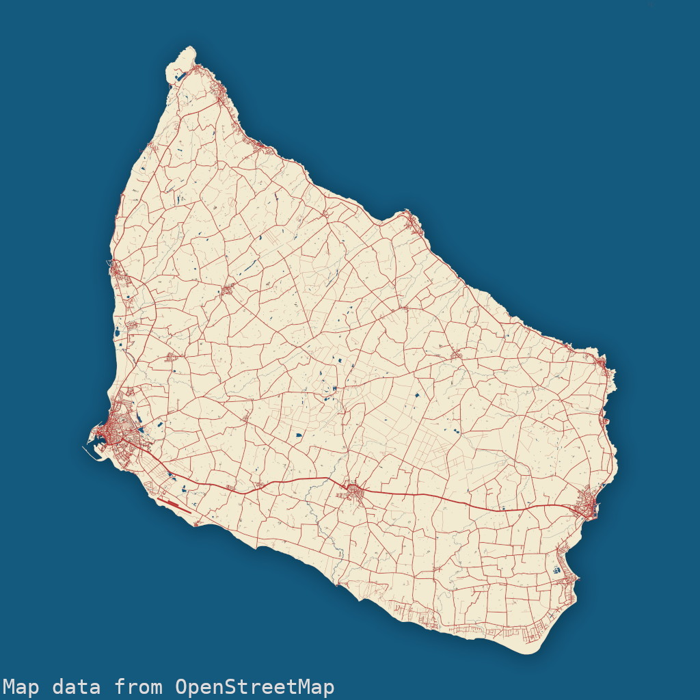
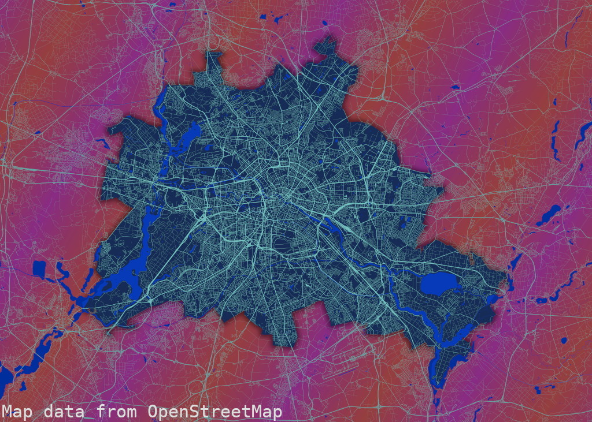
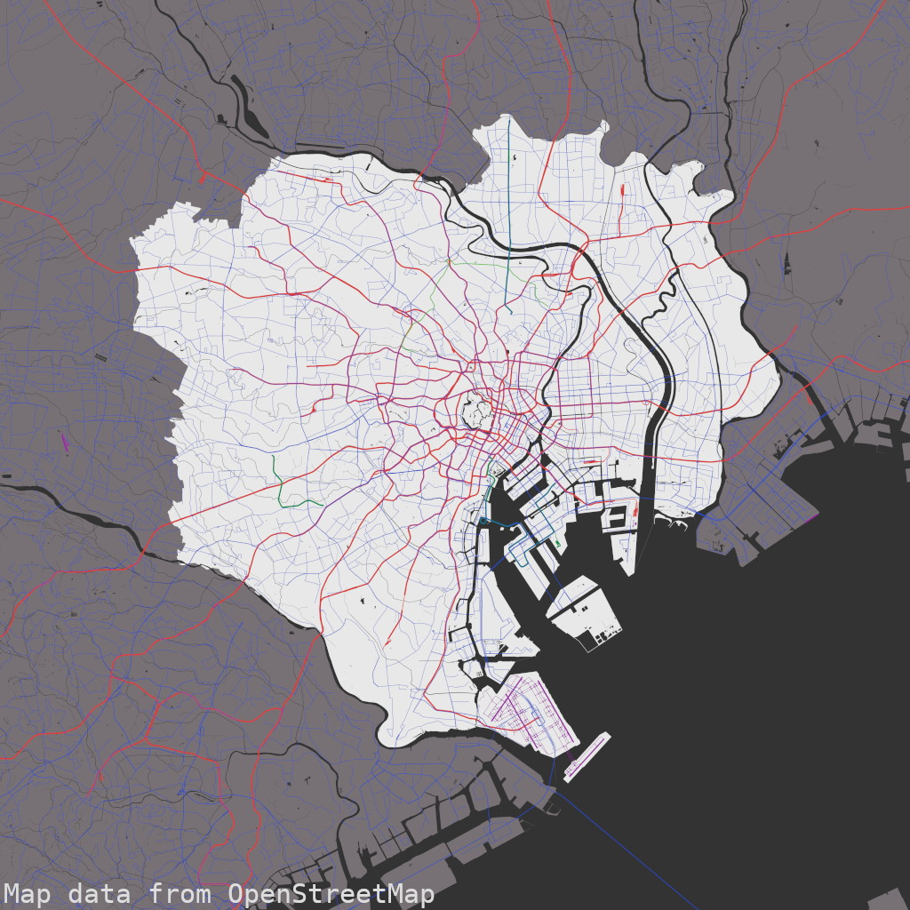

# osmposter

Create abstract maps and beautiful images from OSM data

## Examples

| Bornholm      | Berlin      | Tokyo |
| ------------- | ----------- | ----- |
|  |  |  |

## Setup

1. Install python dependencies: `osmium` and `pycairo`
2. Clone this repository
3. Find the OSM relation that will be the center of your map
    - Search for a city, region or any other area and take note of the ID: e.g. https://www.openstreetmap.org/relation/62422 (`62422` for Berlin)
4. Download the `.osm.pbf` that covers your area and the sourrounding that you want to render.
    - Use https://download.geofabrik.de/index.html or use the https://extract.bbbike.org/ extractor.
    - Download the data file to your computer

## Usage

1. Create a configuration (see below)
2. Run from the repository root directory:
    - `python -m osmposter.osmposter path/to/your/config.json`
3. All output layers will be created under `./output/[your label]/...png`
4. Stack the layers with an editing tool of your choice (like GIMP), add effects, shadows, ...

## Structure of config.json

Due to the `# comments`, the following is invalid JSON. Please use any file from the [examples/](examples/) directory as a starting point.

```
{
  "label": "Berlin",   # mandatory - for output
  "relation": 62422,   # mandatory - used to determine the bounding box

  # mandatory - data file to take OSM data from
  "osmfile": "data/brandenburg-latest.osm.pbf",

  # mandatory - output dimensions: height, width and density
  "output": {
    "w_mm": 700,
    "h_mm": 500,
    "dpi": 300
  },

  # mandatory - extend boundary by factor
  "boundary_extension": {
    "north": 0.2,
    "east": 0.2,
    "south": 0.2,
    "west": 0.2
  },

  "draw": {
    # mandatory - width in mm of a line of width "1"
    "baseline_mm": 0.07,

    # mandatory - list of layers to generate
    "layer": {
      # general structure:
      # "custom_identifier": {
      #   "type": "layer type (see below)",
      #   "options": { ... }
      # }  
      # all layer types support options "color" as  RGB float tuple
      
      # filled polygons of given relation IDs
      "background": {
        "type": "boundary",
        "options": {
          # make sure to include your main relation ID here!
          "ids": [62422]
        }
      },

      # show streets (main streets appear thicker)
      # options:
      #   - only_main_streets (optional, boolean)
      "streets": {
        "type": "streets"
      },

      # show rail lines (main rails appear thicker)
      "railways": {
        "type": "railways"
      },

      # show all buildings
      "buildings": {
        "type": "buildings"
      },

      # show taxiways and runways:
      #   - include_abandoned (optional, boolean)
      #     e.g. show Tegel and Tempelhof in Berlin
      "runways": {
        "type": "aeroways",
        "options": {
          "include_abandoned": true
        }
      },

      # show rivers, streams and other bodies of water
      "water": {
        "type": "water"
      },

      # show routes of different types
      # options:
      #   - width, number, width of route
      #   - tags, object, tags of relation that must match
      #   - ways:
      #     - width, number, width of ways that match...
      #     - tags, object, tags of way that must match
      # 
      # This configuration draws all tram routes
      # and (with thinner lines) all tram tracks
      "tram_lines": {
        "type": "routes",
        "options": {
          "color": [ 0.85, 0.10, 0.10],
          "width": 4,
          "tags": {
            "route": "tram",
            "network:short": "VBB"
          },
          "ways": {
            "width": 2,
            "tags": {
              "railway": "tram"
            }
          }
        }
      }
    }
  }
}

```

## Notes

- The generated image files do not include a Copyright notice or any other attribution. If you plan to use or publish the result in any way, you must add it yourself: https://www.openstreetmap.org/copyright
- Generation speed heavily depends on the amount of data in the `.osm.pbf` files. A 2022 Ryzen CPU processes about 150 MB per minute.
- Depending on the dataset, coastlines may cause trouble and the ocean (or any other large water body) might not appear on the water layer.